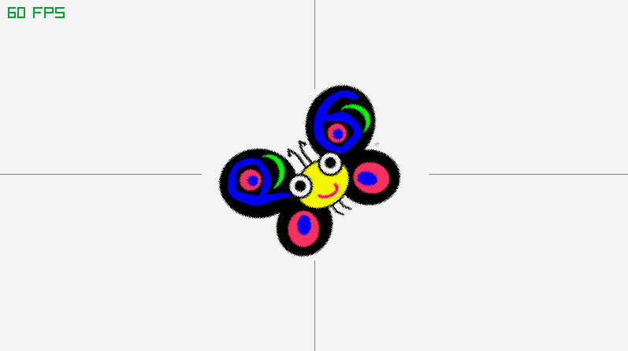
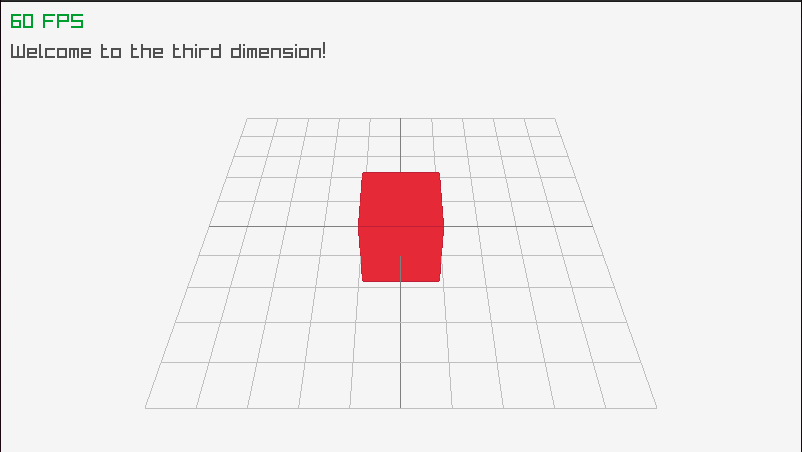

## raylib-raku





Autogenerated raylib-raku bindings, powered by raku grammar and
actions.

### Prerequisite:
install raylib
https://github.com/raysan5/raylib

### Generating bindings from raylib.h
```
git clone git@github.com:vushu/raylib-raku.git
cd raylib-raku
wget https://raw.githubusercontent.com/raysan5/raylib/master/src/raylib.h -P generator
raku generator/generate-bindings.raku
```

### Test

```
raku examples/window.raku
```
### Install from repo
```
git clone git@github.com:vushu/raylib-raku.git
copy your libraylib.so.4.5.x into generator folder ex: from /usr/local/lib/
cd generator
./build.sh 
cd ..
raku examples/rotating-butterfly.raku

```


#### Missing:
- raylib callbacks are yet to be implemented.
- raylib predefined colors.
- support for other platforms other than linux.
- zef distribution for easy usage.


***help is appreciated!***
