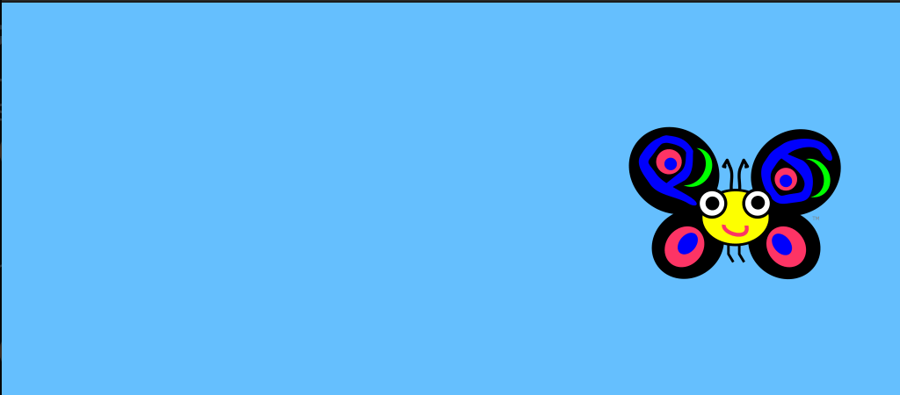
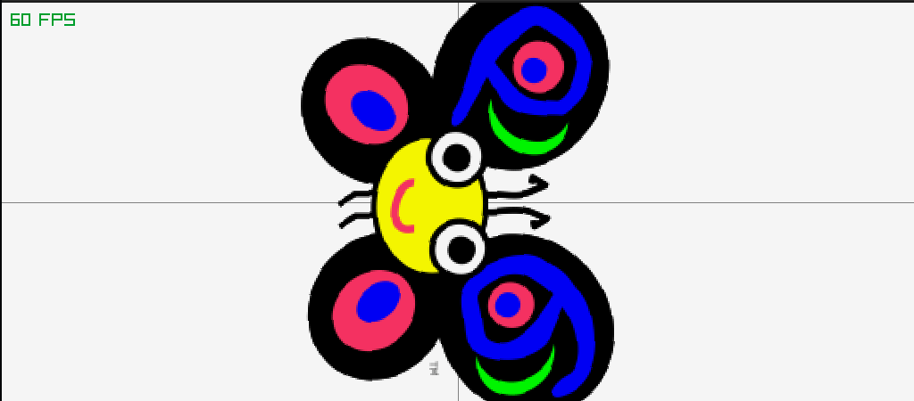

## raylib-raku (Raylib::Bindings)
[](https://ci.sparrowhub.io)

Autogenerated raylib-raku bindings, powered by raku grammar and
actions.
### Preface
To make Raku play together with Raylib, many of Raylib's functions has to be wrapped into a function,
to support pass as pointer meaning we are `"pointerizing"` the functions. This is done automatically when generating the bindings.
The bindings are also converted to `kebab-case` to fit Raku code style.

#### On installation: 
- `Generator.rakumod` is fed `raylib.h` which gets parsed and translated via grammar and actions to Raku and C code. 
- `Bindings.rakumod` will be generated and placed into lib/Raylib 
- The pointerization and allocation C code gets compiled to be used by Raylib::Bindings.

Raylib::Bindings comes with support for malloc-ing Raylib structs, 

Example the code below will allocate Color as a pointer.  
`my $white = Color.init(245, 245, 245, 255);`  

Almost all struct/class in Raylib::Bindings are equipped with an `init` function,  
which  mallocs.  
Manually calling `free` isn't necessary, since every struct/class are also equipped with a `free` on destroy mechanism and gets handled by the GC.
Here is the `DESTROY` method of `Color`
```
submethod DESTROY {
    free-Color(self);
}
```
---
### Prerequisite
*install raylib from:* 
```
https://github.com/raysan5/raylib
```
---
### Install
```
zef install Raylib::Bindings
```
### Install from repository
```
git clone git@github.com:vushu/raylib-raku.git
cd raylib-raku 
zef install .
```
---
### Examples
```
raku examples/window.raku
raku examples/flying-butterfly.raku
raku examples/rotating-butterfly.raku
raku examples/3d-camera.raku
```

### Mutable strings
To parse mutable string use CArray[uint8] important to encode it as `utf-8`
Example:
```
# .encode takes care of UTF-8 encoding. If $array is used 
# as a string by the native function, don't forget to append the 
# NULL byte that terminates a C string: ---------v 
my $array = CArray[uint8].new("Foo".encode.list, 0);
```

#### More examples at
https://www.raylib.com/examples.html

#### Cheatsheet
https://www.raylib.com/cheatsheet/cheatsheet.html
#### Wiki  
https://github.com/raysan5/raylib/wiki

---
### Screenshots






---

#### Missing:
- code comments needs to be included.
- support for windows.

### Problem on some callbacks 
example for `set-audio-stream-callback`:
the following happens:  
```
MoarVM panic: native callback ran on thread (some-thread-id) unknown to MoarVM
```

Solution yet to be found.

***help is appreciated!***
